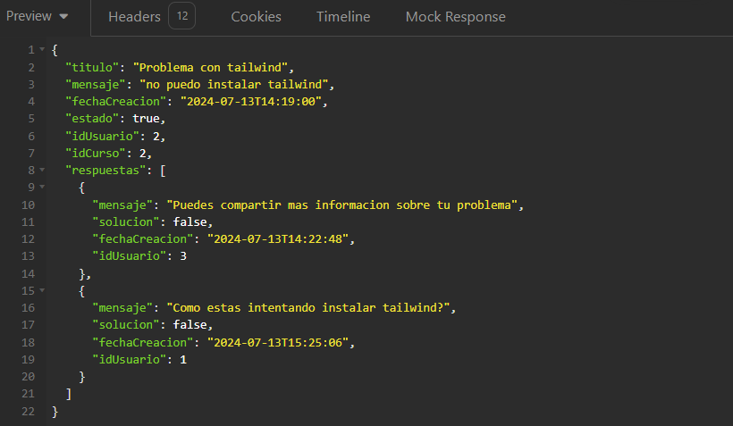

# ForoHub - Desafío con Spring Framework

En este desafío, construiremos una API RESTful utilizando Spring que permita a los usuarios realizar las siguientes operaciones sobre los temas:

- Crear un nuevo tema
- Obtener todos los temas
- Obtener un tema específico
- Actualizar un tema
- Eliminar un tema

## Objetivos del Proyecto

Los objetivos principales de este desafío incluyen:

- Implementar una API REST con endpoints siguiendo las mejores prácticas del modelo REST.
- Aplicar validaciones de reglas de negocio para garantizar la integridad de los datos y la seguridad.
- Utilizar una base de datos relacional para el almacenamiento persistente de datos.
- Configurar servicios de autenticación y autorización para restringir el acceso a la información.
- Opcionalmente, documentar la API utilizando Swagger.

## Funcionalidades Adicionales

Opcionalmente, implementar rutas adicionales como `/usuario` y `/respuestas` para mejorar la funcionalidad de la API.

## Prerrequisitos 

Asegúrate de tener las siguientes herramientas y dependencias instaladas:

- Maven 4+
- Spring 3.2.3+
- MySQL 8+ o PostgreSQL 16+
- Lombok
- Spring Web
- Spring Boot DevTools
- Spring Data JPA
- Flyway Migration
- MySQL Driver o PostgreSQL Driver
- Validation
- Spring Security

## Galería

Aquí tienes un vistazo de ForoHub:

- Endpoints disponibles


- Documentacion con Swagger

 

- Base de datos


- Detalles del topico




## Empezando

Sigue estos pasos para configurar y ejecutar el proyecto:

1. **Clona el repositorio:**

   ```bash
   git clone https://github.com/pzric/Foro-hub.git
   cd Foro-hub

2. **Compila y ejecuta el proyecto:**

   ```bash
   mvn spring-boot:run

3. **Accede a la API:**

    Abre tu navegador y ve a http://localhost:8080/swagger-ui.html para interactuar con la API.
  
## Documentación

Explora los endpoints de la API y su uso en la Documentación de Swagger.

## Licencia
Este proyecto está licenciado bajo la Licencia MIT.

## Author ✒️

* **Ricardo Zamora Picazo** - [Ricardo ZP](https://github.com/pzric)